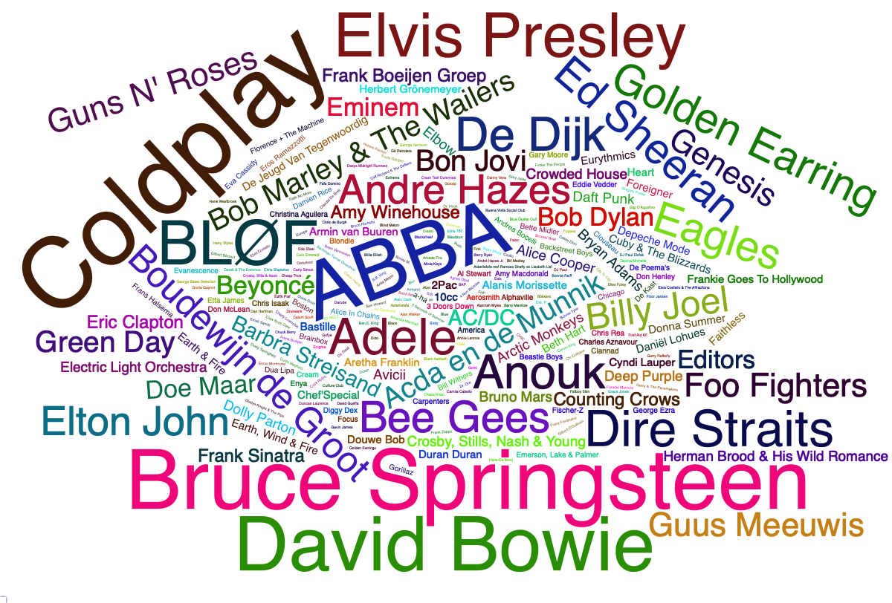
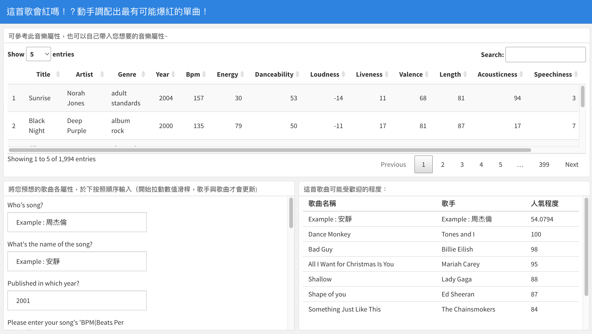
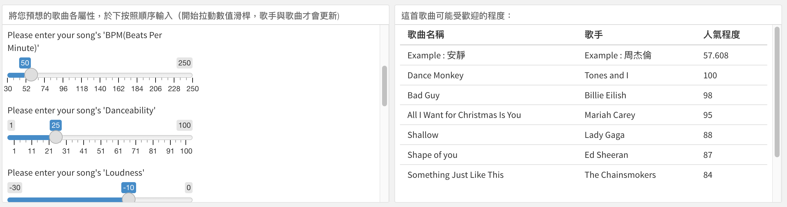

```{r setup, include=FALSE}
knitr::opts_chunk$set(echo = TRUE)
```

```{=html}
<style type="text/css">
  body{
  font-size: 15pt;
}

td {  /* Table  */
  font-size: 11px;
}

h1.title {
  font-size: 59px;
}
h1 { /* Header 1 */
  font-size: 39px;
  color: #66CDAA;
}
h2 { /* Header 2 */
  font-size: 31px;
 
}
h3 { /* Header 3 */
  font-size: 15px;
  font-family: "Times New Roman", Times, serif;
  
}
code.r{ /* Code block */
    font-size: 13px;
    font-family : "Times New Roman";
}
pre { /* Code block - determines code spacing between lines */
  font-size: 13px;
  font-family : "Times New Roman";
}

</style>
```

# **Introduction**{.tabset}

## **1. Research Topic**
This study focuses on Spotify Top Songs from 1956 to 2019 as the main analysis target. By analyzing the characteristics of highly popular songs across different eras, we aim to identify common traits of the most popular songs, which can help predict the potential of newly released songs to become hits.

## **2. Motivation**
Every year, countless songs are released, and some become viral hits with millions of streams. Perhaps your song could be this year’s breakout hit.  
By listening to past hit songs, we noticed that popular songs often share similar characteristics in style, lyrics, and rhythm. Songs with certain elements tend to achieve a certain level of popularity.  
This led us to consider that analyzing high-traffic songs over the years could help identify the common elements of hit songs and predict the likelihood of a new song becoming popular.  
Additionally, this analysis can help record labels allocate marketing budgets efficiently, directing resources to songs with the highest potential.


## **3. Research Methodology**
We obtained the Spotify All Time Top Songs Mega Dataset from Kaggle. This study uses fourteen features for analysis (including Title, Artist, Top Genre, Year, BPM, Energy, Danceability, Loudness (dB), Liveness, Valence, Duration, Acousticness, Speechiness, Popularity).  
Feature explanations:
  > Title: Song title  
  > Artist: Artist name  
  > Top Genre: Song genre  
  > Year: Release year of the song  
  > Beats per Minute (BPM): Song tempo  
  > Energy: Song energy level, higher values indicate higher energy  
  > Danceability: Danceability of the song, higher values indicate easier to dance along  
  > Loudness: Song loudness in decibels, higher values mean louder under the same volume baseline  
  > Valence: Positivity of the song, higher values indicate more positive mood  
  > Acousticness: Higher values indicate more acoustic elements in the song  
  > Speechiness: Higher values indicate more spoken word components  
  > Length: Song duration in minutes  
  > Popularity: Higher values indicate greater popularity, range from 0 to 100  

To ensure clarity in analysis, data is segmented by decades from the 1950s to 2010s. Basic visualizations such as bar charts and scatter plots are used to analyze Top Genre, BPM, musical attributes (highlighted in red), and song duration.  
We explore yearly trends in BPM and Loudness to examine if song tempo or loudness has increased over the years, reflecting changing public preferences.  
Beyond basic analysis, we also study correlations among musical attributes using a pheatmap, and examine the popularity of different genres based on musical features to understand listener preferences.

## **4. Extended Discussion and Conclusion**
Knowing the characteristics of hit songs over the years allows us to create an interactive web tool. Users can input a song and get a prediction of its likelihood to become a hit based on its features.  
Possible extensions:
1. Direct user interaction  
2. Recommend potentially popular songs by genre  
3. Incorporate other elements, e.g., whether the song contains explicit lyrics, and how that affects popularity  

Music is an art form, but in the era of big data, public preferences can also be quantified. We can predict whether new songs have hit potential, helping in strategic planning for music production and marketing.

```{r ,include=FALSE }
setwd("/Users/misia/Documents/GitHub/Spotify-Song_popularity_prediction/docs")
data <- read.csv("Spotify-2000.csv")
data <- na.omit(data)
spotify <- subset(data, select=-c(Index))
names(spotify)<-c("Title","Artist","Genre","Year","Bpm", "Energy", "Danceability","Loudness","Liveness","Valence","Length","Acousticness","Speechiness","Popularity")
spotify <- na.omit(spotify)
spotify$Loudness <-spotify$Loudness+22
spotify$Length = as.integer(as.factor(spotify$Length))
```

```{r ,include=FALSE}
#install.packages("ggplot2")
library(ggplot2)
#install.packages("magrittr")
library(magrittr)
#install.packages("dplyr")
library(dplyr)
#install.packages("grid")
library(grid)
library(gridExtra)
#install.packages("highcharter")
library(highcharter)
#install.packages("pheatmap")
library(pheatmap)
#install.packages("GGally")
library(GGally)
#install.packages("tidyverse")
library(tidyverse)
#install.packages("corrgram")
library(corrgram)
#install.packages("car")
library(car)
#install.packages("rpart")
library(rpart)
#install.packages("rpart.plot")
library(rpart.plot)
#install.packages("partykit")
library(partykit)
#install.packages("randomForest")
library(randomForest)
#install.packages("party")
library(party)
#install.packages("viridis")
library(viridis)
#install.packages("gganimate")
library(gganimate)
#install.packages("transformr")
library(transformr)
#install.packages("proxy")
library(proxy)
#install.packages("devtools")
library(devtools)
#devtools::install_github("thomasp85/transformr")
library(transformr)
#install.packages("gifski")
library(gifski)
#install.packages("wordcloud2")
library(wordcloud2)
#install.packages("gridExtra")
library(gridExtra)
#install.packages("ggwordcloud")
library(ggwordcloud)
#install.packages("kableExtra")
library(kableExtra)
```

# **1. Basic Analysis**

## Data Overview
```{r rows.print=3}
spotify
```
```{r class.source = 'fold-show'}
namefreq<-spotify %>% count(Artist)
names(namefreq) <- c("word","freq")
# my_graph<-wordcloud2(namefreq)
# saveWidget(my_graph,"tmp.html",selfcontained = F)
# webshot("tmp.html","fig_1.png", delay =5, vwidth = 1200, vheight=800)

```

From the raw data, we observe the frequency of appearances of each artist. Many familiar names appear!
(Note: We pre-generated the wordcloud as it can cause rendering issues in later plots.)


## Genre Statistics by Decade {.tabset}

### Song Count Trends Over Time

```{r ,include=FALSE}
spotify_genre<-spotify %>% select(Genre,Year)
spotify_genre<-spotify_genre %>% group_by(Year) %>% summarize(Genre=Genre,number=n())
spotify_genre_ad <- spotify_genre %>% filter(Genre %in% c("album rock","dutch indie","dance pop","dutch pop","alternative metal","alternative rock","art rock","dance rock","british invasion"))
```

```{r class.source = 'fold-show'}
p<-spotify_genre_ad %>%
  ggplot(aes(x=Year,group=Genre))+
  geom_line(aes(color=Genre),position="identity",stat="count")+
  transition_reveal(Year)

animate(p)
```

By visualizing the counts by genre, we see that album rock dominated early on, dance music rose around 2000, and the music market became more diverse over time.

```{r}
year <- spotify$Year
sixties_songdata <- spotify %>% filter(Year>1959 & Year<1970)
seventies_songdata <- spotify %>% filter(Year>1969 & Year<1980)
eighties_songdata <- spotify %>% filter(Year>1979 & Year<1990)
nineties_songdata <- spotify %>% filter(Year>1989 & Year<2000)
thousands_songdata <- spotify %>% filter(Year>1999 & Year<2010)
tens_songdata <- spotify %>% filter(Year>2009 & Year<2020)

```

### 1960~1970
```{r}
sixties_songdata %>% group_by(Genre) %>% 
  summarize(Popularity=mean(Popularity))%>%
  arrange(desc(Popularity)) %>% subset(Popularity>60)%>%
  hchart(type="bar",hcaes(x=Genre, y=Popularity))%>%
  hc_xAxis(title = list(text = "歌曲種類"))%>%
  hc_yAxis(title = list(text = "特定種類的平均熱門程度"))
```
The genres with average popularity above 60 show that Classic Soul was the most popular in the 1960s, but differences among genres were small.

```{r}
sixties_songdata%>%
  count(Genre)%>%
  arrange(n)%>%
  hchart(type = "treemap", hcaes(x = Genre, value = n, color = n))
```
Album rock was the most frequent genre, but its average popularity was not the highest, suggesting no direct correlation between quantity and popularity.

### 1970~1980
```{r}
seventies_songdata %>% group_by(Genre) %>% 
  summarize(Popularity=mean(Popularity))%>%
  arrange(desc(Popularity)) %>% subset(Popularity>60)%>%
  hchart(type="bar",hcaes(x=Genre, y=Popularity))%>%
  hc_xAxis(title = list(text = "歌曲種類"))%>%
  hc_yAxis(title = list(text = "特定種類的平均熱門程度"))
```
Classic Soul remains the most popular on average in the 1970s. Album rock’s share increased, pushing down Adult Standard. Examining the popularity range shows Album Rock has the largest variability.
```{r}
seventies_songdata%>%
  count(Genre)%>%
  arrange(n)%>%
  hchart(type = "treemap", hcaes(x = Genre, value = n, color = n))
```
In the 1970s, the proportion of album rock increased, gradually compressing the second-largest genre, adult standard. Comparing with the previous chart, we can see that classic soul has the highest average popularity overall, but there are only four songs in the data. Therefore, we examine the range of popularity for each genre.
```{r}
seventies_songdata %>% group_by(Genre) %>% 
  summarize(Popularity=range(Popularity))%>%
  arrange(desc(Popularity)) %>%
  hchart(type="bar",hcaes(x=Genre, y=Popularity))%>%
  hc_xAxis(title = list(text = "歌曲種類"))%>%
  hc_yAxis(title = list(text = "特定種類的熱門程度範圍"))
```
The largest range is observed in album rock, suggesting that the large variation in popularity results in a lower average popularity for this genre.

### 1980~1990

```{r}
eighties_songdata %>% group_by(Genre) %>% 
  summarize(Popularity=mean(Popularity))%>%
  arrange(desc(Popularity)) %>% subset(Popularity>62)%>%
  hchart(type="bar",hcaes(x=Genre, y=Popularity))%>%
  hc_xAxis(title = list(text = "歌曲種類"))%>%
  hc_yAxis(title = list(text = "特定種類的平均熱門程度"))
```
In the 1980s, several new genres achieved high average popularity. Interestingly, many of the top genres can be classified as having "exotic traditional" styles, such as celtic punk from Ireland, along with emerging British and Canadian music styles.
```{r}
eighties_songdata%>%
  count(Genre)%>%
  arrange(n)%>%
  hchart(type = "treemap", hcaes(x = Genre, value = n, color = n))
```
The proportion of album rock decreased significantly in the 1980s, replaced by more exotic-style music, suggesting that the U.S. music market became increasingly culturally diverse.

### 1990~2000
```{r}
nineties_songdata %>% group_by(Genre) %>% 
  summarize(Popularity=mean(Popularity))%>%
  arrange(desc(Popularity)) %>% subset(Popularity>62)%>%
  hchart(type="bar",hcaes(x=Genre, y=Popularity))%>%
  hc_xAxis(title = list(text = "歌曲種類"))%>%
  hc_yAxis(title = list(text = "特定種類的平均熱門程度"))
```
In the 1990s, pop genres increased in popularity. The rise of pop punk corresponds to the popularity of dance hall culture. Rock and metal bands also became more popular.
```{r}
nineties_songdata%>%
  count(Genre)%>%
  arrange(n)%>%
  hchart(type = "treemap", hcaes(x = Genre, value = n, color = n))
```
Although album rock and alternative rock remained the main genres, their proportion gradually decreased, while pop genres gained popularity, consistent with the previous chart.

### 2000~2010
```{r}
thousands_songdata %>% group_by(Genre) %>% 
  summarize(Popularity=mean(Popularity))%>%
  arrange(desc(Popularity)) %>% subset(Popularity>70)%>%
  hchart(type="bar",hcaes(x=Genre, y=Popularity))%>%
  hc_xAxis(title = list(text = "歌曲種類"))%>%
  hc_yAxis(title = list(text = "特定種類的平均熱門程度"))
```
Besides the continuing rise of pop music, hip hop also became highly popular, with many subgenres appearing among the top popular categories.

```{r}
thousands_songdata%>%
  count(Genre)%>%
  arrange(n)%>%
  hchart(type = "treemap", hcaes(x = Genre, value = n, color = n))
```
Dance pop replaced album rock in terms of proportion, but rock music still held a significant share when grouped together. Hip hop, though lower in proportion, was very popular.

### 2010~2019
```{r}
tens_songdata %>% group_by(Genre) %>% 
  summarize(Popularity=mean(Popularity))%>%
  arrange(desc(Popularity)) %>% subset(Popularity>70)%>%
  hchart(type="bar",hcaes(x=Genre, y=Popularity))%>%
  hc_xAxis(title = list(text = "歌曲種類"))%>%
  hc_yAxis(title = list(text = "特定種類的平均熱門程度"))
```
After 2010, exotic-style music achieved high popularity. Listeners' tastes became more diverse, but pop music remained dominant.

```{r}
tens_songdata%>%
  count(Genre)%>%
  arrange(n)%>%
  hchart(type = "treemap", hcaes(x = Genre, value = n, color = n))
```

## Relationships Between Music Features {.tabset}

### Overall Observation
```{r}
spotify_characteristic <- spotify %>% select(Popularity,Energy,Danceability,Loudness,Liveness,Valence,Acousticness,Speechiness)
names(spotify_characteristic)<-c("Popularity", "Energy", "Danceability","Loudness","Liveness","Valence","Acousticness","Speechiness")
GGally::ggcorr(data = spotify_characteristic, method = c("complete", "pearson"))
```

    Popularity shows some positive correlation with Energy and Danceability; other features show little or no significant correlation. Energy and Loudness are highly correlated, suggesting potential multicollinearity. We will next examine songs with Popularity > 70.

### Observation Popularity\>70
```{r}
spotify_popularity70 <- subset(spotify, Popularity >= 70)

spotify.active70 <- spotify_popularity70 %>% 
  select(Popularity,Energy,Danceability,Loudness,
         Liveness,Valence,Acousticness,Speechiness)

GGally::ggcorr(data = spotify.active70, method = c("complete", "pearson"))
```
    

    For songs with Popularity > 70, only Loudness and Danceability maintain relatively high positive correlation, while other features show low or negligible correlation.


# **2.Build PCA Model**

## Regression Analysis of Song Popularity on Features
```{r}
spotify1<-spotify[,-c(1:3)]
spotify_mc <- data.frame((spotify1))
lm_pop_to_char<-lm(Popularity~Year+Bpm+Energy+Danceability+Loudness+Liveness+Valence+Length+Acousticness+Speechiness,data=spotify_mc)
summary(lm_pop_to_char)
```
From the previous correlation plot, potential multicollinearity is observed. We will check individual VIF values:


```{r}
vif<-data.frame(vif(lm(Popularity~Year+Bpm+Energy+Danceability+Loudness+Liveness+Valence+Length+Acousticness+Speechiness,data=spotify_mc)))

vif<-vif %>% summarize(variables=c("Year","Bpm","Energy","Danceability","Loudness","Liveness","Valence","Length","Acousticness","Speechiness"),vif_value=vif.lm.Popularity...Year...Bpm...Energy...Danceability...Loudness...) %>% arrange(desc(vif_value))

knitr::kable(vif, width = 100) %>% 
  kable_styling(bootstrap_options = "striped", full_width = F) %>% 
  row_spec(1, bold = T, color = "white", background = "#D7261E")
```
Energy has a VIF > 4, indicating multicollinearity. We check which variables are associated with Energy:
```{r}
summary(lm(Energy~Year+Bpm+Danceability+Loudness+Liveness+Valence+Length+Acousticness+Speechiness,data=spotify_mc))
```
Almost all variables are related to Energy. Therefore, we remove Energy to examine the effect on multicollinearity of other factors:

```{r}
vif1<-data.frame(vif(lm(Popularity~Year+Bpm+Danceability+Loudness+Liveness+Valence+Length+Acousticness+Speechiness,data=spotify_mc)))
vif1<-vif1 %>% summarize(variables=c("Year","Bpm","Danceability","Loudness","Liveness","Valence","Length","Acousticness","Speechiness"),vif_value=vif.lm.Popularity...Year...Bpm...Danceability...Loudness...Liveness...) %>% arrange(desc(vif_value))
knitr::kable(vif1) %>%
  kable_styling(bootstrap_options = "striped", full_width = F)
```
All VIF values are now below 4, reducing model error in subsequent regression analysis.

## Principal Component Analysis (PCA) to Explain Popularity Variance

PCA without Energy:
```{r}
spotify_test <- spotify_mc[,-c(3,11)]
pca_spotify<-prcomp(spotify_test,scale. = TRUE)
pca_spotify
```

```{r}
summary(pca_spotify)
```
PC1–PC3 together explain over half of the variance. To compare with noise, we simulate noise 100 times:

```{r}
sim_noise_ev <- function(n, p) {
  noise <- data.frame(replicate(p, rnorm(n))) 
  eigen(cor(noise))$values
}
evalues_noise <- replicate(100, sim_noise_ev(nrow(spotify),ncol(spotify)))
evalues_mean <- apply(evalues_noise, 1, mean)
screeplot(pca_spotify,type="line")
abline(h=1,col="grey",lty="dotted")
lines(evalues_mean, type="b",col="blue")
```

PC1, PC2, and PC3 are the most representative components of variance compared to noise.

## PCA Loadings{.tabset}
```{r }
top4.pca.eigenvector <- pca_spotify$rotation[,1:4]
first.pca <- top4.pca.eigenvector[, 1] 
second.pca <- top4.pca.eigenvector[, 2] 
third.pca <- top4.pca.eigenvector[, 3] 
```

### PC1
```{r}
dotchart(first.pca[order(first.pca, decreasing=FALSE)] ,   
    main="Loading Plot for PC1",xlab="Variable Loadings", col="red")
```

    PC1 shows the largest positive loading for Acousticness (acousticness). Length is close to zero and not considered.
```{r}
first.pca
```

    We define PC1 as:
    PC1 = -0.2238*Year -0.1116*BPM -0.3991*Danceability -0.4841*Loudness -0.0906*Liveness -0.4628*Valence +0.1114*Length +0.4883*Acousticness -0.2657*Speechiness

### PC2
```{r}
dotchart(second.pca[order(second.pca, decreasing=FALSE)] ,   
    main="Loading Plot for PC2",xlab="Variable Loadings", col="red")
```

    PC2 shows largest positive loading for song length; other positive contributions include Loudness, Energy, and BPM.

```{r}
second.pca
```

    We define PC2 as:
    PC2 = 0.4083*Year +0.2310*BPM -0.4676*Danceability +0.3743*Loudness +0.1728*Liveness -0.4695*Valence +0.3302*Length -0.2480*Acousticness +0.0209*Speechiness

### PC3
```{r}
dotchart(third.pca[order(third.pca, decreasing=FALSE)] ,   
    main="Loading Plot for PC3",xlab="Variable Loadings", col="red")
```

    PC3 shows largest positive loading for song length. PC1 relates most to acoustic features.

```{r}
third.pca
```

    PC3 defined as:
    PC3 = -0.5128*Year +0.5651*BPM -0.2702*Danceability -0.1846*Loudness +0.4497*Liveness +0.1904*Valence -0.0027*Length -0.0244*Acousticness +0.2994*Speechiness 


## Build Regression Model
Regression Using PCA Scores
```{r}
pre <- predict(pca_spotify)
spotify_test$pc1 <- pre[,1]
spotify_test$pc2 <- pre[,2]
spotify_test$pc3 <- pre[,3]
```

```{r class.source = 'fold-show'}
spotify_test$Popularity <- spotify_mc$Popularity
lm.sol<-lm(Popularity~pc1+pc2+pc3, data=spotify_test)
summary(lm.sol)
```
Popularity is highly correlated with PC1 and PC2 (p < 0.01).

```{r class.source = 'fold-show'}
coef<-coef(lm.sol)
coef
```

Linear regression model:
Popularity = 59.5266 - 1.1954*PC1 - 1.4957*PC2 + 0.3693*PC3


## K-Fold Cross Validation
```{r}
k_fold_mse <- function( k, model,outcome,dataset) { 
  shuffled_indicies <- sample(1:nrow(dataset))
  dataset <- dataset[shuffled_indicies,]
  
  fold_pred_errors <- sapply(1:k, \(i) {
  fold_i_pe(i, k, dataset, model,outcome) 
  })
  pred_errors <- unlist(fold_pred_errors) 
  mse<-\(errs) mean(errs^2)
  c(is=mse(residuals(model)),oos=mse(pred_errors))
}

fold_i_pe <- function(i, k, dataset, model,outcome) { 
  folds <- cut(1:nrow(dataset),k, labels = FALSE)
  test_indices <- which(folds==i) 
  test_set <- dataset[test_indices,] 
  train_set <- dataset[-test_indices,] 
  trained_model <- update(model,data=train_set)
  predictions <- predict(trained_model, test_set)
  dataset[test_indices,outcome] - predictions 
}
```


```{r class.source = 'fold-show'}
pc_mse<-k_fold_mse(10,lm.sol,"Popularity",spotify_test)
pc_mse
```

In-sample MSE: 198.8105, Out-of-sample MSE: 199.6508.

# **3. Decision Tree Model** {.tabset}

## Build Decision Tree
```{r class.source = 'fold-show'}
spotify_tree <- rpart(Popularity~Year+Bpm+Danceability+Loudness+Liveness+Valence+Length+Acousticness+Speechiness,data=spotify_test)
rpart.plot(spotify_tree)
```
```{r ,include=FALSE}
mse_oos<-function(actuals, preds) { 
  mean( (actuals - preds)^2 )
}
```

## Decision Tree Model MSE
```{r class.source = 'fold-show'}
mse_oos_decision <-mse_oos(spotify_test$Popularity,predict(spotify_tree,spotify_test))
mse_oos_decision
```


# **4.Random Forest Model**{.tabset}

## Build Random Forest
```{r ,include=FALSE}
set.seed(1)
randomforest_spotify <- randomForest(Popularity~Year+Bpm+Danceability+Loudness+Liveness+Valence+Length+Acousticness+Speechiness,data=spotify_test,importane=T,proximity=T,do.trace=100)
```

```{r class.source = 'fold-show'}
plot(randomforest_spotify)
```

    The plot shows the error gradually decreases during training, making the model closer to the actual values.
```{r class.source = 'fold-show'}
varImpPlot(randomforest_spotify)
```
    
    The Variable Importance Plot shows the most important factors: Year, Length, and Danceability are highly important.
    
## Random Forest MSE
```{r class.source = 'fold-show'}
set.seed(1)
randomforest_spotify <- randomForest(Popularity~Year+Bpm+Danceability+Loudness+Liveness+Valence+Length+Acousticness+Speechiness,data=spotify_test,importane=T,proximity=T,do.trace=100)
```

# **5.Comparison of Three Models**

We compare the MSE of PCA, Decision Tree, and Random Forest models:

```{r}
mse_compare <- data.frame(model=c("PCA test","Decision tree","Random forest"),mse_oos = as.numeric(c(199.3977,180.535,174.2)))
```

```{r}
mse_compare %>% arrange(-mse_oos)%>%
  ggplot(aes(x=model,y=mse_oos,fill=model))+
  geom_bar(stat="identity", width=0.5)+
  scale_fill_brewer(palette="Greens")+
  geom_text(aes(label = mse_oos), vjust = 2)
```

    Random Forest achieves the lowest MSE, so we choose it for predictions.

# **6. Demo: New Data**

We test the model with songs from 2019 using Random Forest to predict popularity:

```{r }
new_song <- read.csv("New song.csv",header=T)
names(new_song)<-c("Title","Artist","Year","Genre","Bpm", "Energy", "Danceability","Loudness","Liveness","Valence","Length","Acousticness","Speechiness","Popularity")

new_song$Length = as.integer(as.factor(new_song$Length))
new_song
```

```{r ,include=FALSE}
new_song$Loudness <-new_song$Loudness+22
predict_new_song <- new_song %>% 
  select(Year,Bpm,Danceability,Loudness,Liveness,Valence,Length,Acousticness,Speechiness)
```

Predict popularity using Random Forest:
```{r class.source = 'fold-show'}
predicted_data <- predict(randomforest_spotify, newdata=predict_new_song)
predicted_data
```

Compare predicted vs actual values:

## Demo 結果
```{r }
Popularity <- c("predicted","real")
Value <- c(round(predicted_data,3),new_song$Popularity)
compare <- data.frame(Popularity,Value)
compare %>% ggplot(aes(x=Popularity,y=Value,fill=Popularity))+
  geom_bar(stat="identity", position=position_dodge(),width=0.5)+
  scale_fill_brewer(palette="Greens")+
  geom_text(aes(label = Value), vjust = 2)
```
    
Prediction: 65.963 vs actual: 75, difference = 9.037 (~12.05% of actual).

# **7.Shiny Interactive Webpage**

We designed a Shiny app to allow users to input features and get predicted popularity:

https://samuel0731.shinyapps.io/spotify_shiny_website/

```{r }

```
Top shows historical song data; bottom-left: user inputs song name, artist, and features:
```{r }

```
Right panel shows predicted popularity and comparison with other songs.

# **Conclusion** {.tabset}
    
This study analyzed the evolution of music genres over decades using visualizations. Using PCA, Decision Tree, and Random Forest, we found Random Forest yields the lowest MSE, making it the best prediction model. Finally, we implemented a Shiny interactive platform for user-friendly predictions.
